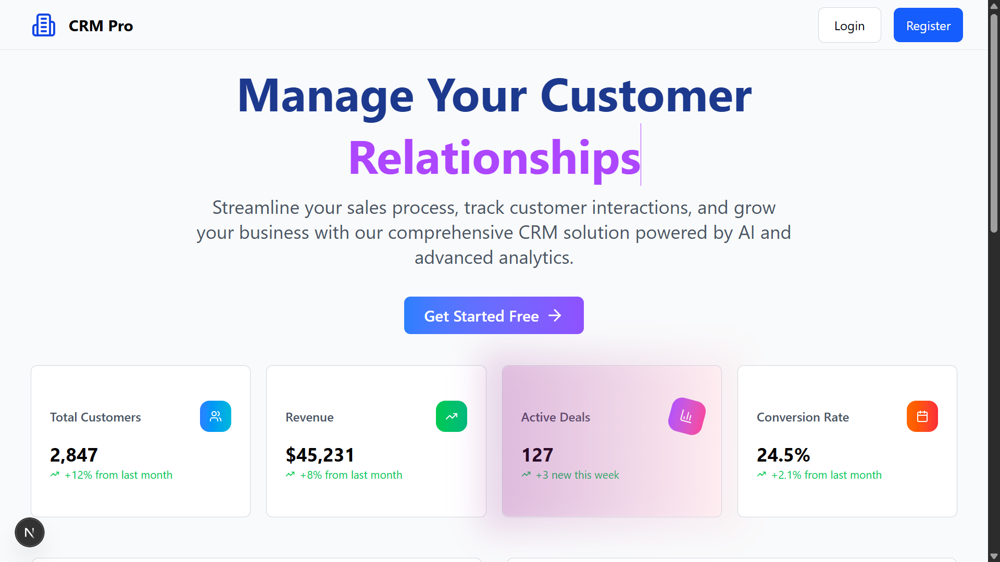

# crm_general

 
 


---

## 📝 Description

**CRM General** is a modern full-stack Customer Relationship Management solution designed to streamline business-client interactions.  
It features a high-performance web interface with a robust API backend, allowing businesses to efficiently manage customer data, track engagements, and optimize workflows. Built with **Next.js**, **React**, and **TypeScript**, it ensures a type-safe, scalable, and responsive experience.

---

## ✨ Features

- 🌐 RESTful API endpoints for clients and users  
- 🕸️ Web portal with dashboards, forms, and real-time updates  
- 🔒 Secure authentication and session management  
- 📊 Customer, deals, and task management  
- ⚡ Responsive, fast, and intuitive UI

---

## 🛠️ Tech Stack

- **Frontend:** Next.js, React, TypeScript  
- **Styling:** Tailwind CSS  
- **Backend:** Next.js API Routes + Prisma ORM  
- **Database:** PostgreSQL / SQLite (via Prisma)  

---

## 🚀 Getting Started

### 1. Clone the repository
```bash
git clone <repo-url>
cd crm_general
```
### 2. Install dependencies
```bash
npm install
# or
yarn install
```
### 3. Configure environment variables

Create a .env file based on .env.example and configure your database URL and JWT secrets.

### 4. Run the development server
```bash
npm run dev
# or
yarn dev
```
Open http://localhost:3000 to view the app.

### 5. Build and start (production)
```bash
npm run build
npm run start
```

---

## 📁 Project Structure
```
.
├── app/                 # Pages and API routes
├── components/          # UI components (buttons, cards, forms, navbars)
├── lib/                 # Utility libraries (Prisma client)
├── prisma/              # Database schema & migrations
├── public/              # Static assets (images, SVGs)
├── tsconfig.json
├── next.config.ts
├── package.json
├── postcss.config.mjs
└── middleware.ts
```

## 🧪 Usage
- Access dashboards for clients, deals, and tasks
- Use forms to create or manage users, deals, and tasks
- API routes support integration with external tools or scripts

## 📌 Notes
- Full-stack TypeScript for type safety
- Prisma ORM ensures easy database migrations and queries
- Tailwind CSS enables rapid, responsive UI development
